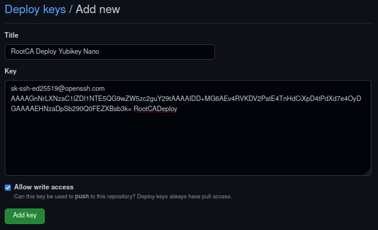

# rootca

Tools to create an manage the Lab internal PKI Root Certificate Authority.

`rootca` is the primary command to abstract commands for OpenSSL, Yubikey
Manager, Yubico PIV Tool, and Yubikey Personalization.

## How To Use

Pull image from Github or Quay:

```sh
podman pull ghcr.io/wranders/lab-rootca:latest
```

```sh
podman pull quay.io/wranders/lab-rootca:latest
```

Create an alias:

```sh
rootca() {
    env | grep --color=auto LRCA_
    podman run -it --rm --security-opt=label=disable --name=lab-rootca  \
        ${LRCA_YUBIKEY:+--device=$LRCA_YUBIKEY}                         \
        ${LRCA_YUBIFIDO:+--device=$LRCA_YUBIFIDO}                       \
        ${LRCA_YUBISEC:+--volume=$LRCA_YUBISEC:/media/YUBISEC}          \
        ${LRCA_ROOTCAKEY:+--volume=$LRCA_ROOTCAKEY:/media/ROOTCAKEY}    \
        ${LRCA_ROOTCA:+--volume=$LRCA_ROOTCA:/media/ROOTCA}             \
        ${LRCA_ROOTCA:+--env=ROOTCA_DIR=/media/ROOTCA}                  \
        ${LRCA_CONTAINER_RUNTIME_ARGS}                                  \
        ${LRCA_CONTAINER_IMAGE:-ghcr.io/wranders/lab-rootca:latest} "$@"
    return $?
}
```

| Environment Variable          | Description
| :-                            | :-
| `LRCA_YUBIKEY`                | Yubikey device (eg. `/dev/yubikey`)
| `LRCA_YUBIFIDO`               | Yubikey FIDO2 device (eg. `/dev/yubifido`)
| `LRCA_YUBISEC`                | Yubikey Secrets directory (mounted to `/media/YUBISEC`)
| `LRCA_ROOTCAKEY`              | Root CA Private Key backup directory (mounted to `/media/ROOTCAKEY`)
| `LRCA_ROOTCA`                 | Root CA Data Directory (mounted to `/media/ROOTCA`)
| `LRCA_CONTAINER_RUNTIME_ARGS` | Container runtime args (eg `--volume ${PWD}:/srv`)
| `LRCA_CONTAINER_IMAGE`        | Alternative `rootca` container image

---

## Getting Started

This image contains a helper script to prepare the host operating system and
devices for use with the `rootca` container.

```sh
podman run -i --rm ghcr.io/wranders/lab-rootca:latest \
    get-hostconfig > hostconfig
chmod +x hostconfig
```

```sh
# Install the SELinux policy that allows Podman to directly mount USB devices.
# This is required to pass a Yubikey to the container.
sudo ./hostconfig install-selpolicy

# Install the udev rule that will create predictable names for Yubikey devices.
# Yubikey PIV (Smartcard) applications without serial numbers exposed via USB
#   will be mounted at '/dev/yubikey', whereas having serial numbers exposed
#   will appear as '/dev/yubikeyXXXXXXXXXX' where 'XXXXXXXXXX' is the serial
#   number.
# Yubikey FIDO2 applications without serial numbers exposed via USB will be
#   mounted at '/dev/yubifido', whereas having serial numbers exposed will
#   appear as '/dev/yubifidoXXXXXXXXXX' where 'XXXXXXXXXX' is the serial number.
# If multiple Yubikeys are inserted in the host without serial numbers exposed,
#   the '/dev/yubikey' and '/dev/yubifido' mountpoints will be linked to the
#   last Yubikey to be inserted. Enabling serial numbers via USB is recommended
#   if you use multiple Yubikey devices
sudo ./hostconfig install-udevrule

# Format a block device with the directories needed to store CA data.
# Creates an encrypted partition for Yubikey secrets (YUBISEC), a partition for
#   OpenSSL data (ROOTCA), and optionally an encrypted partition for storing
#   the Root CA private key (ROOTCAKEY).
sudo ./hostconfig format-cadata /dev/sdb

# Decrypts and mounts partitions on the block device. Partitions are expected to
#   have been created with 'format-cadata' command.
# Mounts partitions to '/run/media/${USER}/{YUBISEC,ROOTCA,ROOTCAKEY}'
sudo ./hostconfig mount-cadata /dev/sdb

# Unounts and closes encrypted partitions on the block device.
sudo ./hostconfig umount-cadata /dev/sdb
```

To run the container:

```sh
export  LRCA_YUBIKEY=/dev/yubikey \
        LRCA_YUBISEC=/run/media/${USER}/YUBISEC \
        LRCA_ROOTCAKEY=/run/media/${USER}/ROOTCAKEY \
        LRCA_ROOTCA=/run/media/${USER}/ROOTCA
```

The `LRCA_YUBIKEY` environment variable can be omitted if you're not using it
and are instead using a private key directly.

Similarly, `LRCA_ROOTCAKEY` can be omitted if that partition was not created, or
if the private key is not needed.

### Enable Yubikey Serial Number

OTP must be enabled to configure serial number visibility.

```sh
rootca yubiconf otp enable
```

```sh
rootca yubiconf serial enable
```

Optionally if you're using a Yubikey Nano, it's easy to accidentally trigger the
OTP code, so you might want to disable it.

```sh
rootca yubiconf otp disable
```

Exit the container, then unplug and reinsert the Yubikey. It should then appear
as `/dev/yubikey0123456789`.

If the `LRCA_YUBIKEY` environment variable is set to `/dev/yubikey`, reset it to
use the new device identifier.

```sh
export LRCA_YUBIKEY=/dev/yubikey0123456789
```

---

## Root CA Setup

### Configure Yubikey

Generate the Yubikey secrets that will be used to manage the Yubikey, as well as
access the key for signing operations.

```sh
rootca yubiconf gen-secrets /media/YUBISEC
```

Reset and set the secrets on the Yubikey.

```sh
rootca yubiconf set-secrets \
    --key /media/YUBISEC/KEY \
    --pin /media/YUBISEC/PIN \
    --puk /media/YUBISEC/PUK
```

### Generate Root CA Key

There are two ways to generate the private key:

Directly on the Yubikey (secure, but risky as there's no backup):

```sh
rootca genpkey --algo ec --length 384 \
    --yubikey \
    --slot 9a \
    --mgmt /media/YUBISEC/KEY \
    --pin /media/YUBISEC/PIN
```

Using OpenSSL, then installing on the Yubikey

```sh
rootca genpkey --algo ec --length 384 --out /media/ROOTCAKEY/ca.key
rootca yubiconf import-key \
    --slot 9a \
    --key /media/ROOTCAKEY/ca.key \
    --mgmt /media/YUBISEC/KEY
```

### Initialize Root CA Data and Sign Certificate

```sh
rootca init --yubikey --slot 9a \
    --aia http://ca.doubleu.codes/DoubleU_Root_CA.crt \
    --cdp http://ca.doubleu.codes/DoubleU_Root_CA.crl
```

The `ROOTCA` directory is populated with the `ca`, `certs`, `crl`, and `db`
directories, and the `openssl.cnf` configuration file.

```sh
rootca create-root \
    --subj "/CN=DoubleU Root CA/O=DoubleU Labs/C=US/DC=doubleu/DC=codes" \
    --years 20 \
    --yubikey \
    --slot 9a \
    --pin /media/YUBISEC/PIN \
    --install \
    --mgmt /media/YUBISEC/KEY
```

The PEM-encoded certificate request, certificate, and public key are stored in
`ROOTCA/ca` as `root_ca.csr.pem`, `root_ca.crt.pem`, and `root_ca.pub.pem`
respectively.

### Generate Certificate Revocation List

```sh
rootca new-crl \
    --yubikey \
    --pin /media/YUBISEC/PIN
```

Both PEM and DER encoded CRLs are generated and stored in
`ROOTCA/crl` as `root_ca.crl.pem` and `root_ca.crl` respectively. The
DER-encoded CRL is required ar the CRL Distribution Point (CDP).

### Sign Suboridinate CA

Mount a directory to the working directory of the container, then sign the csr
and issue the certificate.

```sh
LRCA_CONTAINER_RUNTIME_ARGS="--volume=${PWD}:/srv" \
    rootca sign-subca \
        --in ./issuing_ca.csr.pem \
        --out ./issuing_ca.crt.pem \
        --yubikey \
        --pin /media/YUBISEC/PIN
```

If the default Distinguished Name policy is used, then the `countryName` (`C`)
and `organizationName` (`O`) must match the Root CA, and a `commonName` (`CN`)
and `domainComponent` (`DC`) must be supplied with the request. All other DN
components are optional.

## Deploy Certificate and CRL to Github

To achieve this, we're going to rely on the Yubikey's FIDO2 application to
leverage repository deploy keys. Certificate and CRLs will be uploaded to this
repository and published via Github Pages, making the AIA and CDP locations
configured on the Root Certificate available.

### Set up FIDO2

```sh
export LRCA_YUBIFIDO=/dev/yubifido0123456789
```

```sh
rootca shell ykman fido reset -f
```

```sh
rootca shell ykman fido access change-pin
```

```sh
rootca shell mkdir /media/YUBISEC/GIT
```

```sh
rootca shell \
    ssh-keygen -t ed25519-sk \
        -C RootCADeploy \
        -O resident \
        -O application=ssh:RootCADeploy \
        -O verify-required \
        -f /media/YUBISEC/GIT/id_ed25519_sk
```

If the console hangs, you may need to touch the key.

```sh
rootca shell cat /media/YUBISEC/GIT/id_ed25519_sk.pub
```

In the repository, go to `Settings` > `Deploy keys` > `Add deploy key`. Pick an
easily identifiable name for the `Title`, paste the public key on the `Key` box,
and be sure to check `Allow write access`.



Clone repo, copy DER-encoded Certificate and CRL.

```sh
git add .
```

```sh
GIT_CONFIG_NOSYSTEM=1 GIT_CONFIG=/dev/null HOME=/dev/null \
    git -c user.name=RootCADeploy -c user.email=admin@doubleu.codes \
        commit -m 'updated assets'
```

OR

```sh
GIT_CONFIG_NOSYSTEM=1 GIT_CONFIG=/dev/null HOME=/dev/null \
    git -c user.name=RootCADeploy -c user.email=admin@doubleu.codes \
        -c user.signingkey=0123456789ABCDEF0123456789ABCDEF01234567 \
        -c commit.gpgsign=trues -c gpg.program=/usr/bin/gpg \
        commit -m 'updated assets'
```

```sh
KNOWNHOSTS=$(mktemp) && \
    curl -s https://api.github.com/meta | \
    jq -r '.ssh_keys[]' | \
    while read -r key; do echo "github.com $key"; done > $KNOWNHOSTS
```

```sh
GIT_SSH_COMMAND="ssh -F /dev/null \
    -i /media/YUBISEC/GIT/id_ed25519_sk \
    -o UserKnownHostsFile=$KNOWNHOSTS" \
    git push git@github.com:wranders/ca
```
